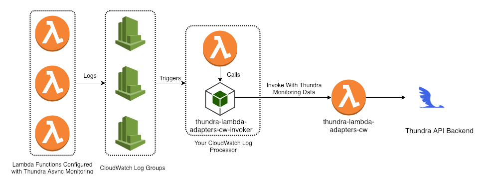

# thundra-lambda-adapters-cw-invoker-nodejs

This utility library reads Thundra agents's async monitoring data from your CloudWatch logs and invokes your deployed `thundra-lambda-adapters-cw` function with the monitoring data. 

Check out [Thundra docs](https://docs.thundra.io/docs/how-to-setup-async-monitoring) for more information about async monitoring.



## Installation
```bash
npm install @thundra/thundra-lambda-adapters-cw-invoker --save
```

## Usage
Just require this module and configure it and pass your cloudwatch event to invoke function:

```js
const invoker = require("@thundra/thundra-lambda-adapters-cw-invoker")({
    adapterFunctionName : 'thundra-lambda-adapters-cw-function'
});

exports.handler = (event, context, callback) => {
    // Return promise if no callback is given as second parameter
    invoker.invoke(event).then((result) => {
        callback(null, result);
    }).catch((err) => {
        callback(err, null);
    }); 

};
```

You can also pass callback function as second parameter: 

```js
const invoker = require("@thundra/thundra-lambda-adapters-cw-invoker")({
    adapterFunctionName : 'thundra-lambda-adapters-cw-function'
});

exports.handler = (event, context, callback) => {
    // Accepts callback as second parameter
    invoker.invoke(event, (err, result) => {
        if (err) {
            callback(err, null);
            return;
        } 
        callback(null, result);
    });
};
```

## Configuration

Environment variables have **higher precedence** over initialization parameters.

#### 1. Environment variables

| Name                                                            | Type   | Default Value |
|:----------------------------------------------------------------|:------:|:-------------:|
| thundra_agent_lambda_debug_enable                               | bool   |    false      |
| thundra_agent_lambda_adapters_cw_function_name                  | string |    empty      |
                    
#### 2. Programmatic configuration

```js
const invokerLib = require("@thundra/thundra-lambda-adapters-cw-invoker");

exports.handler = (event, context, callback) => {
    var options = {
        adapterFunctionName: 'thundra-lambda-adapters-cw-function',
        debugEnabled: true
    };

    var invoker = invokerLib(options);

    invoker.invoke(event, (err, result) => {
        if (err) {
            callback(err, null);
            return;
        } 
        callback(null, result);
    });
};
```

## How to build
[Webpack](https://webpack.js.org/) is used as a module bundler.

To build the project,
 ```bash
 npm install
 npm run build
 ```

## How to test
Tests are written using [Jest](https://facebook.github.io/jest/).

To run tests,
 ```bash
 npm run test
 ```
 